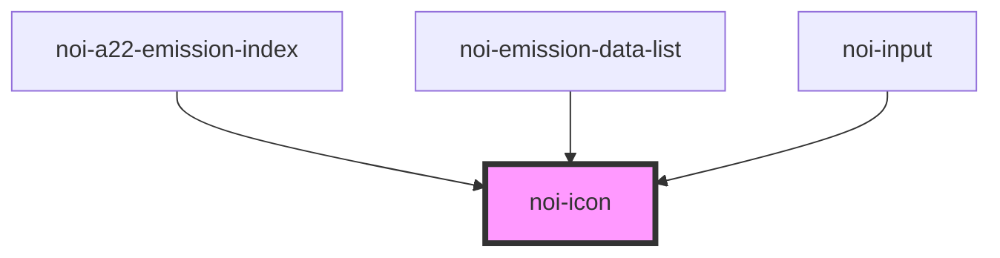

<!--
SPDX-FileCopyrightText: NOI Techpark <digital@noi.bz.it>

SPDX-License-Identifier: CC0-1.0
-->

# noi-icon

<!-- Auto Generated Below -->

## Overview

(INTERNAL) render an icon.

Icons are embedded inside the component (so far).

Icon size can be changed by 'font-size' style

## Properties

| Property | Attribute | Description | Type     | Default     |
| -------- | --------- | ----------- | -------- | ----------- |
| `name`   | `name`    | icon name   | `string` | `undefined` |

## Dependencies

### Used by

 - [noi-a22-emission-index](../../public-components/a22-emission-index)
 - [noi-emission-data-list](../../public-components/a22-emission-index/partials/emission-list)
 - [noi-input](../input)

### Graph

----------------------------------------------

*Built with [StencilJS](https://stenciljs.com/)*
