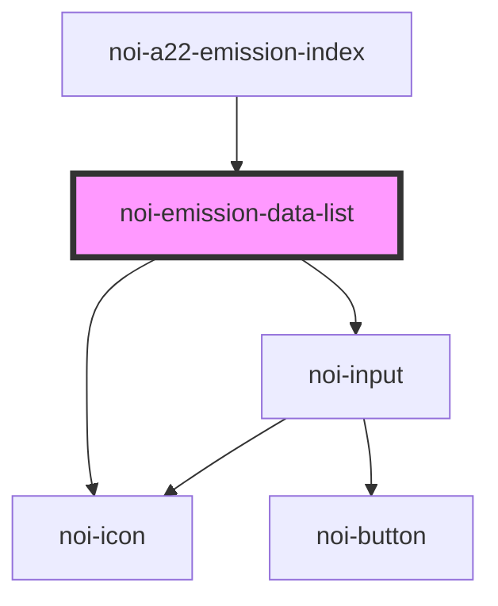

<!--
SPDX-FileCopyrightText: NOI Techpark <digital@noi.bz.it>

SPDX-License-Identifier: CC0-1.0
-->
# noi-air-quality-list

<!-- Auto Generated Below -->

## Overview

(INTERNAL)

## Properties

| Property     | Attribute     | Description | Type             | Default |
| ------------ | ------------- | ----------- | ---------------- | ------- |
| `idSelected` | `id-selected` |             | `string`         | `null`  |
| `stationArr` | --            |             | `EmissionData[]` | `null`  |

## Events

| Event       | Description | Type                        |
| ----------- | ----------- | --------------------------- |
| `itemClick` |             | `CustomEvent<EmissionData>` |

## Dependencies

### Used by

 - [noi-a22-emission-index](../..)

### Depends on

- [noi-icon](../../../../blocks/icon)
- [noi-input](../../../../blocks/input)

### Graph

----------------------------------------------

*Built with [StencilJS](https://stenciljs.com/)*
