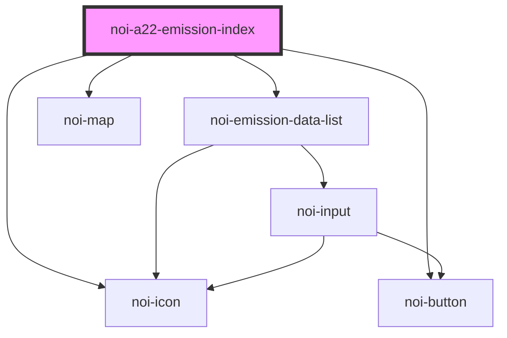

<!--
SPDX-FileCopyrightText: NOI Techpark <digital@noi.bz.it>

SPDX-License-Identifier: CC0-1.0
-->
# noi-a22-emission-index

<!-- Auto Generated Below -->

## Overview

Road air quality component

## Properties

| Property              | Attribute               | Description                   | Type                                          | Default  |
| --------------------- | ----------------------- | ----------------------------- | --------------------------------------------- | -------- |
| `language`            | `language`              | Language                      | `string`                                      | `'en'`   |
| `layout`              | `layout`                | Layout appearance             | `"auto" \| "desktop" \| "mobile" \| "tablet"` | `'auto'` |
| `legendHideThreshold` | `legend-hide-threshold` | Hides legend threshold values | `boolean`                                     | `false`  |

## Methods

### `refreshData() => Promise<void>`

Reload camera data

#### Returns

Type: `Promise<void>`

## Shadow Parts

| Part            | Description     |
| --------------- | --------------- |
| `"footer"`      |                 |
| `"list"`        | stations list   |
| `"map"`         | Map             |
| `"marker"`      | Map marker      |
| `"marker-icon"` | Map marker icon |
| `"popup"`       | Popup dialog    |

## CSS Custom Properties

| Name                            | Description                               |
| ------------------------------- | ----------------------------------------- |
| `--color-background`            | Background color                          |
| `--color-footer`                | Footer background color                   |
| `--color-level-high`            | Color for 'poor' air quality              |
| `--color-level-high-contrast`   | Contrast color for 'poor' air quality     |
| `--color-level-low`             | Color for 'good' air quality              |
| `--color-level-low-contrast`    | Contrast color for 'good' air quality     |
| `--color-level-medium`          | Color for 'moderate' air quality          |
| `--color-level-medium-contrast` | Contrast color for 'moderate' air quality |
| `--color-level-unknown`         | Color for unknown/missing air quality     |
| `--color-primary`               | Primary color                             |
| `--color-primary-rgb`           | Primary color in RGB format               |
| `--color-secondary`             | Secondary color                           |
| `--color-tertiary`              | Third color                               |
| `--color-text`                  | Text color                                |
| `--map-line-color`              | Map line color                            |
| `--scrollbar-bg`                | Scrollbar background color                |
| `--scrollbar-color`             | Scrollbar thumb color                     |

## Dependencies

### Depends on

- [noi-emission-data-list](./partials/emission-list)
- [noi-button](../../blocks/button)
- [noi-icon](../../blocks/icon)
- [noi-map](../../blocks/map)

### Graph

----------------------------------------------

*Built with [StencilJS](https://stenciljs.com/)*
